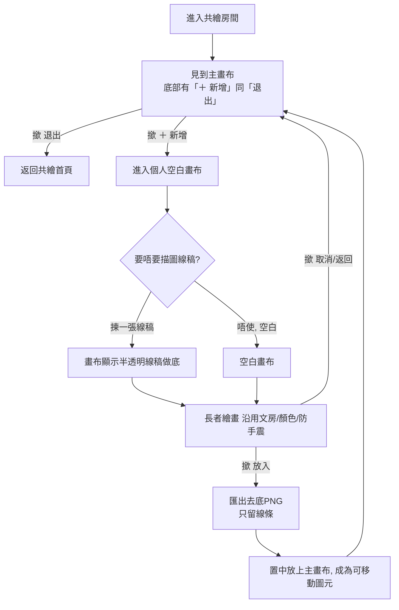

# 共繪模式重構規劃（Multiplayer Redesign）

> 狀態：**規劃中，未動程式**。本檔記錄新設計嘅方向、流程同技術做法，等你 review 過先落實。
> 建立日期：2026-07-16。作者：Claude（同 Kelvin 一齊傾）。

---

## 0. 先講兩件要緊事

1. **v3.10.3 其實未上線。** 之前修問題 1／2／3 嘅程式碼（commit `c1c9ff6`）因為 `git push` 撞網絡失敗、亦冇成功重新 deploy，所以**線上跑緊嘅仍然係舊版**。呢個就係你而家見到「共繪重返仍然唔見返之前畫嘅嘢」嘅真正原因——唔係修唔到，係根本未上到線。
2. **我睇唔到你提供嘅影片。** 今次收唔到影片附件，本規劃係基於你嘅文字描述＋3 條問題嘅答案。如果影片入面有我漏咗嘅細節，請話我知或重新傳一次。

---

## 1. 已確認嘅決定（你嘅答案）

| 項目 | 決定 |
|---|---|
| 創作模式 | **完全取代**——共繪主畫布唔再俾人直接手繪，全部人改用「新增 → 放入」貢獻圖案 |
| 半透明線稿 | 喺**個人畫布**上做描圖底（長者照住描）；線稿本身唔會放落主畫布 |
| 放入嘅圖案 | 當作**可移動／縮放／刪除嘅「圖元」**，自動保存＋即時同步俾房友，重返房間會見返 |

---

## 2. 點解呢個設計順便解決「問題1」

現況：自由手繪筆觸從來冇存入房間（要靠未 deploy 嘅即時筆觸同步先得），所以重返一片空白。

新設計：貢獻改用「**圖元**」。而圖元系統本身**一直都 work**：

- 放入 → `socket.emit('add_element', { image: 去底PNG })`
- 伺服器存入 `room.elements` 並廣播 `element_added` 俾其他房友（即時見到）
- 任何人加入／重返 → `init_room` 會送返 `room.elements` → 逐個重繪

所以只要改用圖元貢獻，**重返房間自然會見返大家放入嘅圖案**，唔使再依賴嗰條未搞掂嘅即時筆觸同步。

---

## 3. 新流程（使用者角度）



---

## 4. 畫面設計（wireframe）

### 4.1 房間主畫面
```
┌────────────────────────────────────────┐
│  房間號碼：1234                         │
│                                        │
│         [ 共繪主畫布 ]                  │
│    （顯示大家放入嘅線條圖案，          │
│      可揀住拖、縮放、刪除）            │
│                                        │
├────────────────────────────────────────┤
│           [ ＋ 新增 ]   [ 退出 ]        │
└────────────────────────────────────────┘
```
- **＋ 新增**：入去個人空白畫布繪畫。
- **退出**：離開房間，返共繪首頁。

### 4.2 個人畫布畫面（撳「新增」之後）
```
┌────────────────────────────────────────┐
│ 文房  顏色  防手震         [線稿：▽揀]  │
│ ┌────────────────────────────────────┐ │
│ │                                    │ │
│ │   [ 個人空白畫布 ]                 │ │
│ │   （可選半透明線稿做描圖底）       │ │
│ │                                    │ │
│ └────────────────────────────────────┘ │
├────────────────────────────────────────┤
│           [ 放入 ]   [ 取消/返回 ]      │
└────────────────────────────────────────┘
```
- 沿用獨畫嗰套工具（毛筆／禪繞／擦膠／顏色／粗幼／防手震），長者已熟悉。
- **線稿：揀**：由現有線稿庫揀一張做半透明描圖底（或者「唔用，空白」）。
- **放入**：將自己畫嘅線條去底、放上主畫布。
- **取消/返回**：唔放入，直接返房間。

---

## 5. 「去底，只顯示線條」點做（淺白技術解釋）

1. 個人畫布用**透明背景**（唔填白色）。咁樣只有你畫落去嘅線條先有顏色，其餘位置係透明。
2. 撳「放入」時，將畫布匯出做 PNG——因為背景本身透明，匯出自然**只有線條**，唔使特別「洗底」。
3. 半透明線稿只係**描圖參考**，匯出前會隱藏（或者根本畫喺另一層），所以**唔會**跟住放落主畫布——放入嘅只有長者自己畫嘅線。
4. 匯出嘅透明 PNG 交俾現有 `add_element` → 成為主畫布上一個可移動圖元。

---

## 6. 半透明線稿（點嚟、點揀）

- **重用現有線稿庫**：即「掌櫃」上載嗰批（`/api/linearts`），喺個人畫布上以半透明（例如 opacity 0.3）鋪底俾長者描。
- 提供「**唔用線稿（空白）**」選項，想自由創作嘅都得。
- （日後可選）另設一批專供描圖、線條更清晰簡單嘅長者友善線稿。

---

## 7. 要郁邊啲檔案（概覽，未落實）

| 檔案 | 大約要做嘅嘢 |
|---|---|
| `public/index.html` | 房間底部加「新增／退出」兩掣；起一個「個人畫布」畫面（含線稿選擇、放入／返回）。 |
| `public/script.js` | 新增「個人畫布」模式；放入邏輯（透明匯出→`add_element`）；線稿半透明鋪底；**移除／收起**共繪主畫布嘅直接手繪。 |
| `server.js` | **基本上唔使大改**——`add_element`／`element_added`／`init_room(elements)` 已經支援圖片圖元。頂多微調驗證。 |
| 順帶 | v3.10.3 已修好嘅**禪繞間距（問題2）**、**封存重複（問題3）** 一齊 deploy。 |

---

## 8. 仲未定 / 之後要傾

- 主畫布最多放幾多個圖元？超過要唔要限制或者提示？
- 「清空主畫布」／移除唔啱嘅圖元，邊個有權（房主？人人？）？
- 線稿要唔要分主題分類？
- 放入嘅圖元預設幾大（畫布百分比）？
- **影片細節**：我睇唔到，如有特別互動（例如放入嘅動畫、音效、位置規則）請補充。

---

## 9. 建議落地次序（分階段，每階段真驗收先算完）

1. **先處理部署真相**：確認要唔要而家將 v3.10.3 push＋deploy，令問題 2、3 即刻上線（問題1 之後由本重構取代）。
2. **主流程**：房間兩掣 → 個人畫布 → 放入（透明圖元）→ 取代直接手繪。做完派 fresh-context 真驗收（開房→放入→退出→重返，確認圖案仲喺度）。
3. **描圖線稿**：加半透明線稿選擇。
4. 每階段都用真.實測試（唔自己腦補），確認咗先向你報「完成」。

---

_本檔係規劃，未改任何程式。你 review 完、話我知邊度要調整或者可以開工，我先動手。_
